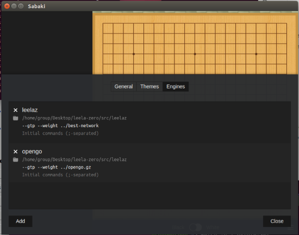
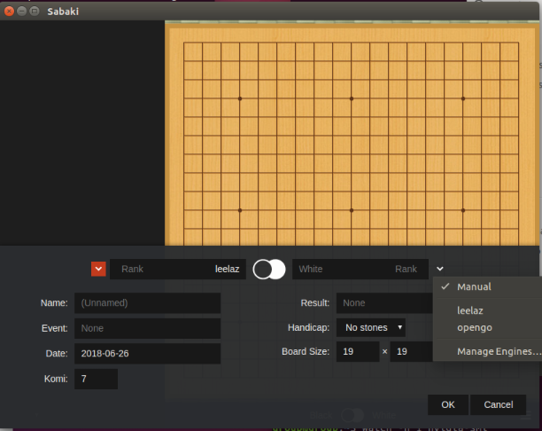
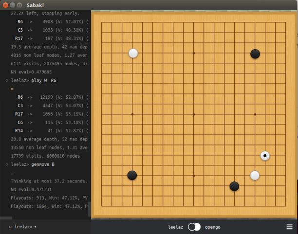

# Setting up OpenGo with leela framework and gaming on Sabaki

## Install Leela - on https://github.com/gcp/leela-zero

1. Test for OpenCL support & compatibility
```
sudo apt install clinfo && clinfo
```

2. Clone github repo
```
git clone https://github.com/gcp/leela-zero
cd leela-zero/src
sudo apt install libboost-dev libboost-program-options-dev libopenblas-dev opencl-headers ocl-icd-libopencl1 ocl-icd-opencl-dev zlib1g-dev
make
cd ..
```

3. Download the latest leela model and test if program works
```
wget http://zero.sjeng.org/best-network
src/leelaz --weights best-network
```

## Download Facebook OpenGo Model for Leela
```
wget http://zero.sjeng.org/networks/62b5417b64c46976795d10a6741801f15f857e5029681a42d02c9852097df4b9.gz
src/leelaz --weight 62b5417b64c46976795d10a6741801f15f857e5029681a42d02c9852097df4b9.gz
```

## Install Sabaki GUI Game Engine

1. Download execute file from https://github.com/SabakiHQ/Sabaki/releases/tag/v0.34.1
2. Run up the AppImage from terminal, for example `$ ./sabaki-v0.34.1-linux-x64.AppImage`

## Setup Leela Framework in Sabaki
1. In Engines -> Manage Engines -> Add
2. Set the game engine execute file to `leela-zero/src/leelaz`
3. Add the argument to specify what model you want to use `--gtp --weights ../best-network` or `--gtp --weights ../Opengo.gz` or set up both engine like the screenshot below



## Start the Game with Two Engine
1. In File -> New
2. Chose two game engine to Black and White side
3. Ok to start the game





## Put the Game Result to Web
1. In file -> Clipboard -> CopySGF, this will save a string contain the information of each step
2. Then put it in the variable content array in Index.html
