# TWGC Maunal

### TWGC Portal: https://twgc-s.nchc.org.tw/cloudfusion/#/

### Log-in

1. You will be re-directed to NARLabs iService page to login, once successfully login, you will be direct to TWGC portal.

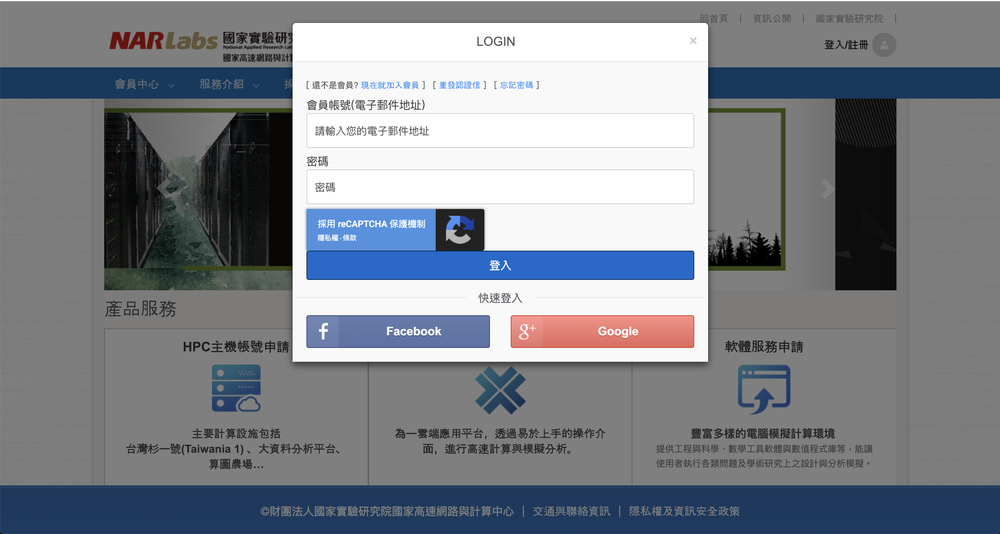

### Activated the TWGC service (you only need to do this for the first time)

1. For the first time you access to TWGC portal, you will be asked to activate the resource pool. Just click activate and wait.
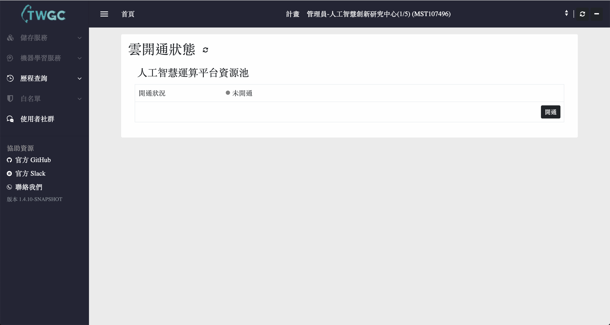

2. Within few minutes, you will see the Home Page of TWGC Portal (If not, just refresh the page).
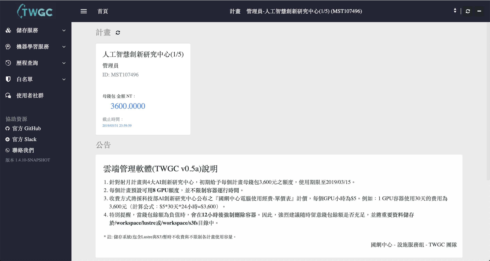

3. Setup SSH Access Key: 
    
    In the `"機器學習服務"` -> `"管理金鑰"` Tab, click add to create new access key for your container. You will get a "pem" file once you create the key. Please do keep it safe and you will need to SSH to your containers with it.
    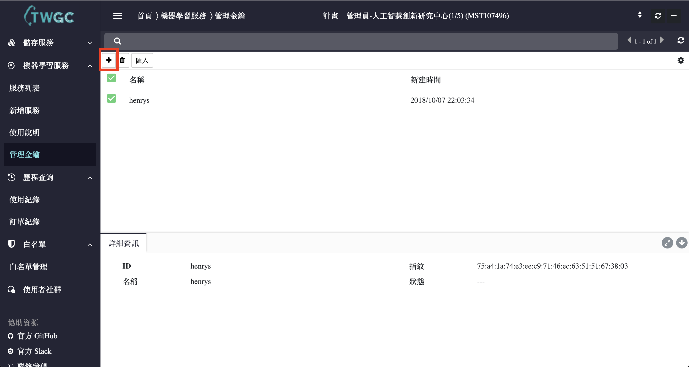

4. Setup IP access whitelist:

    a. The TWGC portal only accept whitelist IPs to connect the containers. In the `"白名單管理"` -> `"白名單管理"` Tab, click add to create IP whitelist. 
    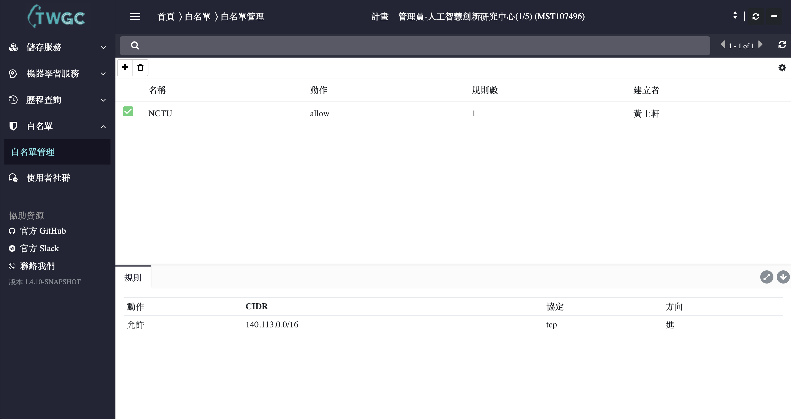

    b. In the rule setting, you can type-in a IP subnet range in CIDR. For example, you can type in 140.113.0.0/16, and your containers can be access from NCTU Network.
    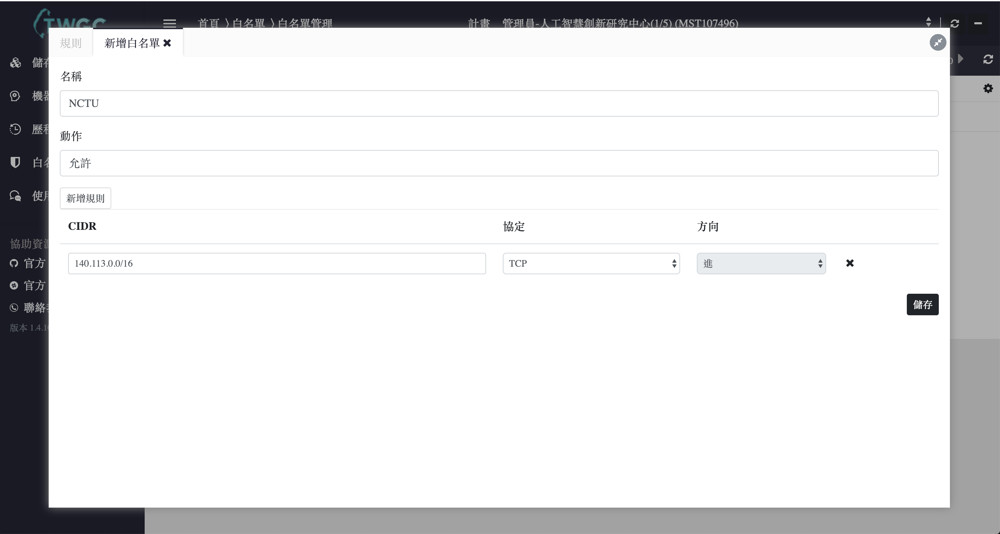

### Create New Container

1. In the `"機器學習服務"` -> `"新增服務"` Tab, type-in the name of container, how many GPU you want to use, which framework you want to use to train and the access key, whitelist you setup before. About the framework spec, you can refer to [Nvidia Deep Learning Framwork Documentation](https://docs.nvidia.com/deeplearning/dgx/support-matrix/index.html)
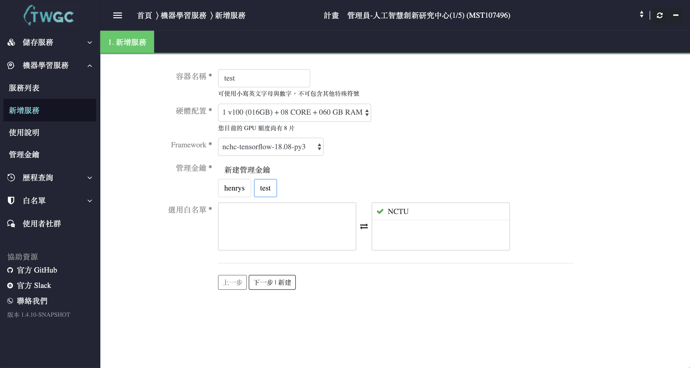

2. Once you create container, you will be directed to `"機器學習服務"` -> `"服務列表"`, here you can see all the container you created. Noticed that create a new container need some times, you can hit the refrest button on the right up cornor to check if the container is ready.
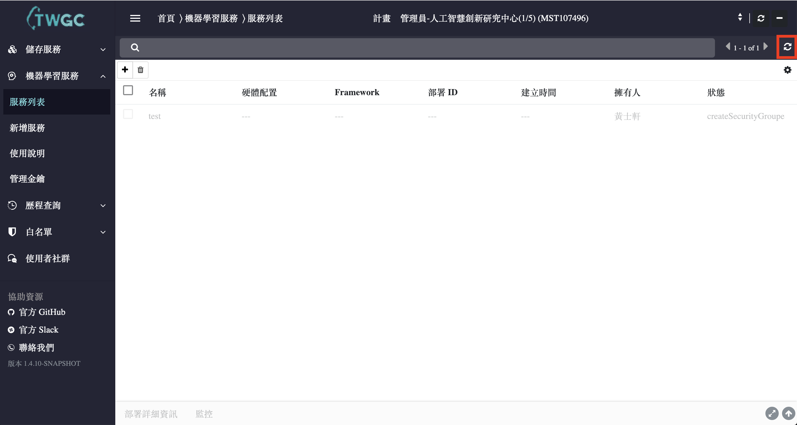

3. When the container is ready, you can access the container with Jupyter Notebook by clicking `"連線"`.
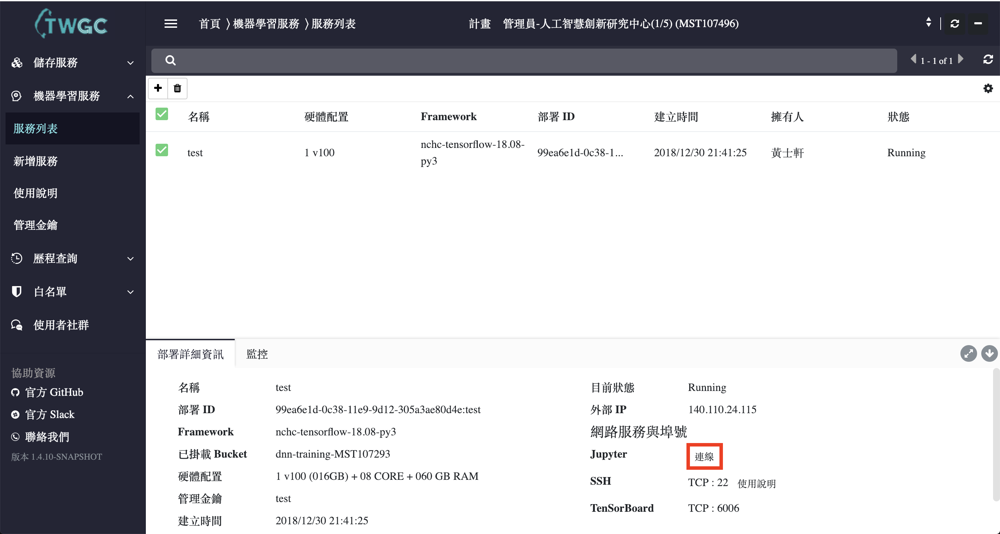

4. You can also access the container throught SSH Tunnel with your private access key using the command 
```
$ chmod 400 "test.pem"
$ ssh -i "test.pem" ubuntu@140.110.x.x
```

### Usage of Container

1. In the Jupyter Notebook, you can create new notebook and run codes, normally I will save the projects in `/luster` folder, which is a share folder to every container you created, and can be access by ftp to upload or download data.

2. You can still have a bash shell in the jupyter to monitor the GPU usage with `` $ nvidia-smi``, or running your python codes.
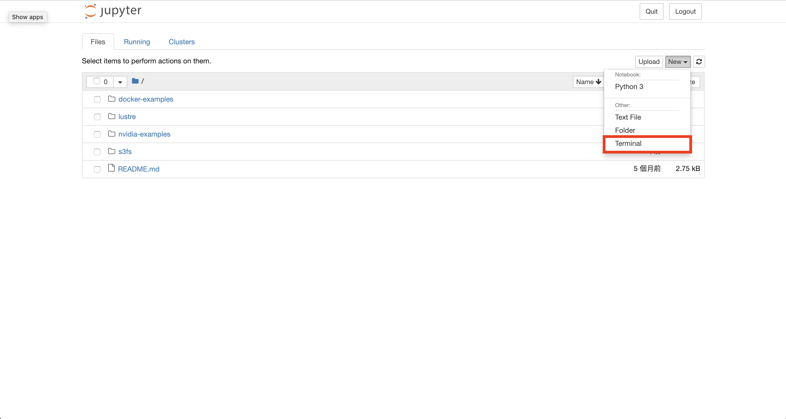

3. Also, you can install custom package for python with pip. For example, you can use `` $ sudo pip install pillow ``, to install `PIL` Package.
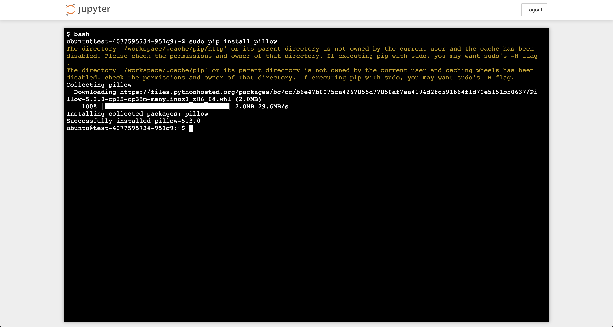

### Storage

1. Normally, for source code and small dataset, I will use `高速平行儲存服務`, which can be found in `儲存服務` -> `高速平行儲存服務` Tab. You can use FTP to upload/download your data, and the data can be acccessed by every container in `/luster`

2. If you need to upload large dataset, you can upload dat to `Amazon S3` Bucket, which can be found in `儲存服務` -> `S3 共用儲存服務` Tab. You will need a tool to upload your data to `Amazon S3` Bucket, for example, in MACOS, I use `forklift` to connect to `Amazon S3 Bucket`
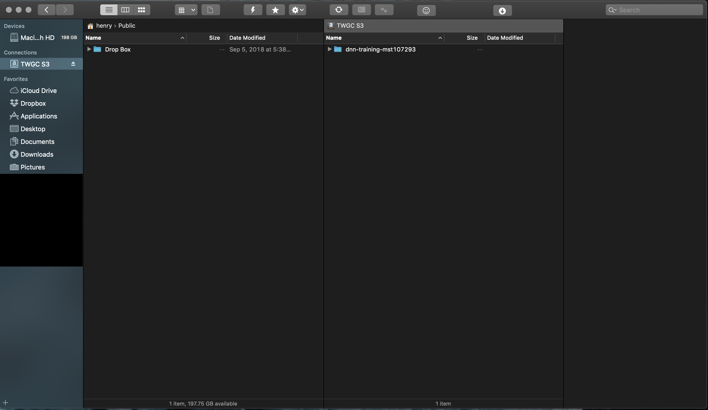

3. NOTE: I strongly recommend to save the source codes in `/luster`. If your container encounter any error, your data won't be lost.
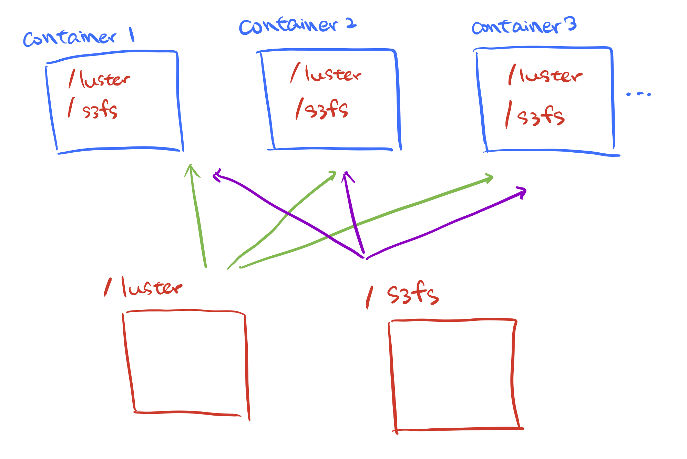


### Some Useful Tips 

1. Sometime the container will having issue on runing jupyter notebook when your container is up for long time, just save your codes and restart a new container.

2. If you don't use the container anymore, please shut it down from the TWGC Portal, otherwise the container will still be charged even if any GPU is using.
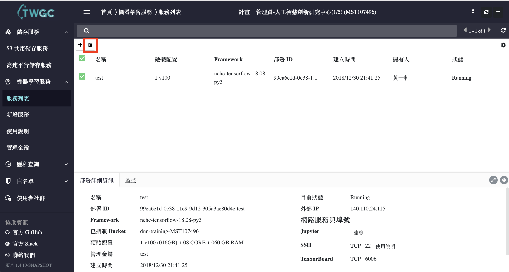

3. If your project need some custom package not within default conatiner, you can write the bash script in the begining of jupyter notebook to install your package automatically. Just put `!` in the begining of shell command. For example, you can write `` !sudo pip3 install keras==2.2.4`` in the begining block of notebook, so `Keras` package will be installed into container everytime you execute it.
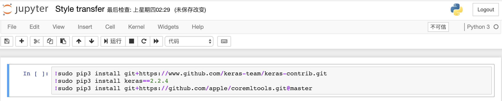 